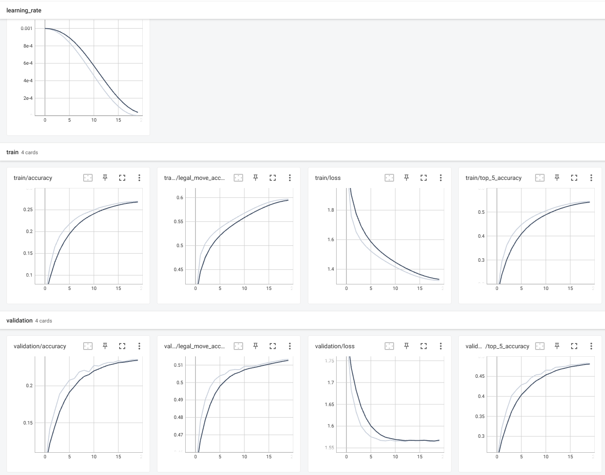

# Chess vs AI

A Python-based chess game where you can play against different AI opponents using various algorithms and machine learning approaches.

## Overview

This application allows users to play chess against four different types of AI opponents:

1. **Heuristic AI**: Makes moves based on position evaluation using piece values and board state analysis.
2. **Minimax AI**: Uses the minimax algorithm with alpha-beta pruning for deeper search.
3. **Supervised Learning AI**: Uses a CNN (Convolutional Neural Network) trained on chess positions to predict the best move.
4. **Reinforcement Learning AI**: (Work in progress) Uses reinforcement learning techniques.

## Features

- Interactive chess board with piece drag and drop
- Visual highlighting of selected pieces and legal moves
- Pawn promotion interface
- Sound effects for moves, captures, check, and promotions
- Game state tracking (checkmate, stalemate, etc.)
- Multiple AI difficulty levels and playing styles

## Project Structure

```
Chess_vs_AI/
├── _pycache_/
├── AI/
│   ├── _pycache_/
│   ├── data/
│   ├── resources/
│   │   ├── _pycache_/
│   │   ├── _check_GPU.py
│   │   ├── _check_legal_moves.py
│   │   ├── _create_tfrecords_moves.py
│   │   ├── _inspect_tfrecord_moves.py
│   │   ├── supervised_CNN_train.py
│   │   └── supervised_model.h5
│   ├── heuristic.py
│   ├── minimax.py
│   ├── reinforcement.py
│   └── supervised_prediction.py
├── Backup/
├── static/
├── .gitignore
├── constants.py
├── requirements.txt
└── scacco.py
```

## Installation

1. Clone the repository:
```bash
git clone https://github.com/yourusername/Chess_vs_AI.git
cd Chess_vs_AI
```

2. Install the required dependencies:
```bash
pip install -r requirements.txt
```

## Usage

Run the main game script:
```bash
python scacco.py
```

## Game Components

The game is built using several classes that handle different aspects of gameplay:

### ChessGame
The main class that coordinates all components and manages the game loop.

### GameLogic
Handles the rules of chess, legal moves, and special moves like promotion.

### BoardScore
Evaluates board positions for the heuristic AI, calculating scores based on:
- Piece values
- Piece positions
- Threats and defenses
- Check status
- Mobility

### GUI
Handles all graphical elements including:
- Drawing the chess board
- Rendering pieces
- Displaying promotion menu
- Showing game intro and outro screens

### SoundManager
Manages sound effects for different game events.

## AI Implementations

### Heuristic AI
Located in `AI/heuristic.py`, this AI evaluates the board using piece values, positions, and threats to determine the best move.

### Minimax AI
Located in `AI/minimax.py`, this AI uses the minimax algorithm with alpha-beta pruning to search for optimal moves by looking several moves ahead.

### Supervised Learning AI
Located in `AI/supervised_prediction.py`, this AI uses a trained CNN model to predict moves based on patterns learned from chess games.

### Reinforcement Learning AI
Located in `AI/reinforcement.py`, this is a work in progress AI that will learn through self-play.

## Training the Supervised Model

The supervised learning model can be trained using:
```bash
python AI/resources/supervised_CNN_train.py
```
This Python script implements a sophisticated Convolutional Neural Network (CNN) for chess move prediction, leveraging TensorFlow and Keras.
It begins by configuring GPU settings to optimize performance, followed by the definition of an `EnhancedChessCNN` model. This model incorporates advanced features such as expanded initial convolutional layers, parallel local and global feature extraction, an attention mechanism, and deep residual blocks. 
A custom loss function, `create_legal_moves_mask_loss`, ensures that the model only considers legal moves during training. 
The script also includes functions for parsing TFRecord datasets, preparing data pipelines, and a detailed training loop with metrics logging, early stopping, and learning rate scheduling.
The `main` function orchestrates the entire training process, handling dataset loading, model compilation, and training execution, designed to train a robust chess AI model from a large dataset of chess positions.  
Current model has been trained on 20MM pairs chess position + move, extracted from winning players in 1800-2300 ELO matches.



## Future Improvements

- Complete implementation of Reinforcement Learning AI
- Implement API Stockfish to evaluate the 4 opponents
- Minor game fatures update 

## Credits

- Chess logic is powered by the [python-chess](https://python-chess.readthedocs.io/) library
- User interface built with [Pygame](https://www.pygame.org/)

## License

[MIT License](LICENSE)